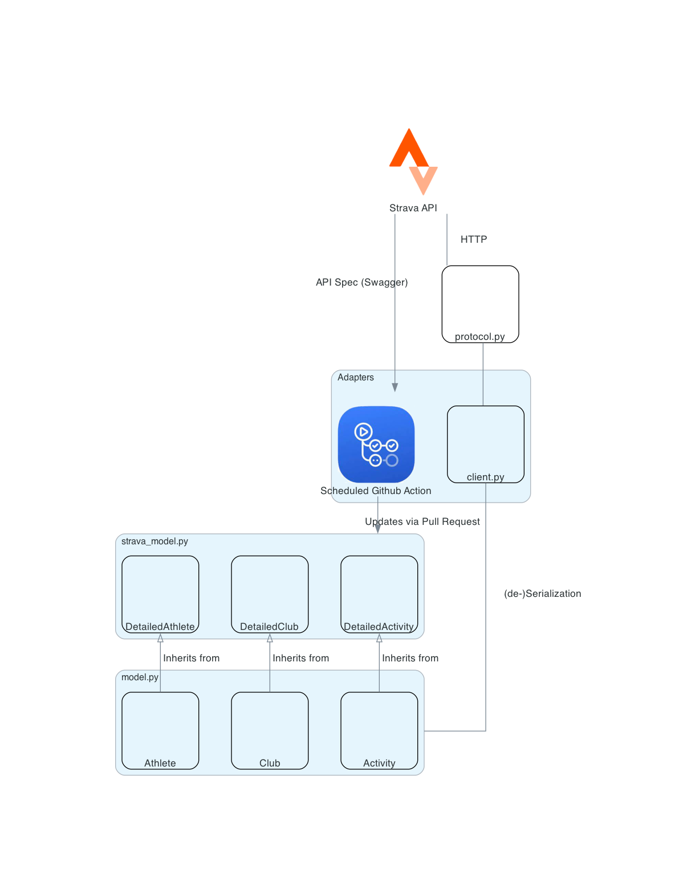

# Development Guide for Anyone Who Wants to Contribute to Stravalib

```{note}
 * Please make sure that you've read our [contributing guide](how-to-contribute.md)
before reading this guide.
* If you are looking for information on our package build structure and release workflow please see our build and [release guide](build-release-guide)
```
The steps to get started with contributing to stravalib are below. You will begin
by forking and cloning our Github repository.

## Fork and clone the stravalib repository

### 1. Fork the repository on GitHub
To create your own copy of the stravalib repository on GitHub, navigate to the
[stravalib/stravalib](https://github.com/stravalib/stravalib) repository
and click the **Fork** button in the top-right corner of the page.

### 2. Clone your fork locally
Next, use ``git clone`` to create a local copy of your stravalib forked
repository on your local filesystem:

```bash
$ git clone git@github.com:your_name_here/stravalib.git
$ cd stravalib/
```

Once you have cloned your forked repository locally, you are ready to create a
development environment.

## Setup a local development environment
We suggest that you create a virtual environment on your computer to work on
`stravalib`. Below, we show you how to do that using a `conda` environment. However,
you are welcome to use pip / `virtualenv` or whatever environment manager that
you prefer!

### Create your local development environment using `conda`

The instructions below assume that you have a conda enabled Python distribution.
Anaconda and miniconda are examples of two conda python distributions.
If you are unsure of which distribution to use,
[we suggest miniconda](https://docs.conda.io/en/latest/miniconda.html) as it is a
lighter weight installation that will minimize environment conflicts given it has
fewer packages and tools bundled with it compared to the much larger Anaconda
distribution.

To begin, install the conda environment.
This will create a local conda environment called `stravalib_dev`

```bash
$ conda env create -f environment.yml
```

Next, activate the environment.

```bash
$ conda activate stravalib_dev
```

Finally install the package dependencies and the `stravalib` package in
development / editable mode (`-e`). Editable mode allows you to make updates
to the package and test them in realtime.

```bash
# install the package requirements
$ pip install -r requirements.txt
# Install stravalib in editable mode
$ pip install -e .
```

## Architecture Overview



Stravalib contains the following main components:

At the core, a (pydantic) domain model is generated and updated by a bot via pull requests.
This model reflects the officially published API specification by Strava and is stored in
the module `strava_model.py`. This file should never be edited  manually. Instead, the stravalib bot will suggest changes to the model through pull requests that can then be merged by stravalib maintainers.

The module `model.py` contains classes that inherit from the
official Strava domain model in `strava_model.py`. This module supports custom typing, unit conversion, (de-)serialization behavior, and support for
undocumented Strava features.

The module `protocol.py` manages the sending of HTTP requests
to Strava and handling the received responses (including rate limiting).
It is used by methods in `client.py` to de-serialize raw response data into
the domain entities in `model.py`.


## Code style and linting

We use the following tools to ensure consistent code format that follows
the Python Enhancement Protocol (PEP) 008 standards. These standards dictate
best practices for Python code readability and consistency:

* [black](https://black.readthedocs.io/en/stable/) for consistent code format
that generally follows [PEP 8 guidlines](https://peps.python.org/pep-0008/).
Because black's default line length is 88 characters, we adjust it to 79
characters in the config [to follow PEP 8 line width guidelines](https://peps.python.org/pep-0008/#maximum-line-length).
* [isort](https://pycqa.github.io/isort/): ensure imports are ordered following [PEP 8 import guidelines](https://peps.python.org/pep-0008/#imports)
* [flake8](https://flake8.pycqa.org/en/latest/): flake8 is a linter. It identifies other PEP 8 issues in the code that Black will not address including comments that extend beyond 79
characters and doc string line width. It also will identify unused imports and
unused but declared variables.

For local development, you can use our [`pre-commit` hook setup](https://pre-commit.com/).
When installed, the pre-commit hook will run each code format
tool, specified in the `pre-commit-config.yaml file`, every time you make a
commit to your local clone of stravalib. If your code doesn't "pass" checks for
each tool then the following happens:

1. If it's a `black` or `isort` error, the code will be fixed / updated by black
and/or isort.
2. If it's a `flake8` error, flake8 will provide you with a list of
issues in your code. You will need to fix each individually by hand.

### Setup and run the pre-commit hooks

To setup the pre-commit hook locally, run:

```
$ pre-commit install
```

The tools installed will be the ones listed in the **.pre-commit-config.yaml**
file.

````{tip}
You can run all hooks locally without a commit by using:

```bash
$ .git/hooks/pre-commit
```

You can also run a single hook using the following:

```
# Only run isort
# pre-commit run isort
```
````

### Pre-commit.ci bot

We use the `https://pre-commit.ci`, in addition to pre-commit in our local
build to manage pull requests. The configuration for this bot can be found
in the ci: section of the `pre-commit-config.yaml` file.
This bot can run all of the code format hooks on every pull request if it's set
to do so.

Currently, we have the bot setup to only run when it's asked to run on a PR.
To call the bot on a pull request, add the text:

`pre-commit.ci run`

as a single line comment in the pull request. The bot will automatically run
all of the hooks that it is configured to run.


```{tip}
If you have an open Pull Request but you need to make some changes locally,
and the bot has already run on your pull request and added a commit, you can
force push to the pull request to avoid multiple bot commits.

To do this simply:
* Do not pull down any changes from the pull request,
* Commit your changes locally,

When you are ready to push your local changes use:

`git push origin branch-name-here --force`

If you have not yet pulled down pre-commit bot's changes, this will
force the branch to be in the same commit state as your local branch.

```

## Code format and syntax
If you are contributing code to `stravalib`, please be sure to follow PEP 8
syntax best practices.

### Docstrings

**All docstrings** should follow the
[numpy style guide](https://numpydoc.readthedocs.io/en/latest/format.html#docstring-standard).
All functions/classes/methods should have docstrings with a full description of all
arguments and return values.

```{warning}
This also will be updated once we implement a code styler
While the maximum line length for code is automatically set by *Black*, docstrings
must be formatted manually. To play nicely with Jupyter and IPython, **keep docstrings
limited to 79 characters** per line.
```

## About the stravalib test suite

Tests for stravalib are developed and run using `pytest`. We have two
sets of tests that you can run:

1. functional end-to-end test suite: this test set requires an API key to run.
1. unit tests that are setup to run on CI. These tests use mock
instances of the API to avoid needed to setup an API key yourself locally.

### Unit - and integration test suite

```{warning}
We will add more information about the test suite in the near future.

For integration tests that should be run independently from Strava, there's a pytest
fixture :func:`~stravalib.tests.integration.conftest.mock_strava_api`
that is based on :class:`responses.RequestsMock`.
It prevents requests being made to the actual Strava API and instead registers responses
that are based on examples from the published Strava API documentation. Example usages of
this fixture can be found in the :mod:`stravalib.tests.integration.test_client` module.
```

We have setup the test suite to run on the stravalib package as installed.
Thus when running your tests it is critical that you have a stravalib
development environment setup and activated with the stravalib package
installed from your fork using pip `pip install .`

You can run the tests using make as specified below. Note that when you run
the tests this way, they will run in a temporary environment to ensure that
they are running against the installed version of the package that you are working on.

To run the test suite use:

```
make test
```

`make test` does a few things:

1. It create a temporary directory called `tmp-test-dir-stravalib` in which your tests are run. We create this test directory to ensure that tests are being run against the installed version of stravalib (with the most recent local development changes as installed) rather than the flat files located in the GitHub repository.
2. It runs the tests and provides output (see below)
3. Finally it removes the temporary directory


### Functional end-to-end test suite
The functional (end-to-end) test suite is set up to hit the STRAVA api.
You will thus need an app setup in your Strava account to run the test suite.
We recommend that you create a dummy account for this with a single activity to avoid
any chances of your data being unintentionally modified. Once you have the app setup
and a valid access_token for an account with at least one activity, follow the steps
below.

1. Rename the file `stravalib/stravalib/tests/test.ini-example` to `test.ini`
2. Add your API token to the file by replacing:

```bash
access_token = xxxxxxxxxxxxxxxx
```
with:

```bash
access_token = your-authentication-token-value-here
```

NOTE: this token needs to have write access to your account.
We recommend that you create
a dummy account to ensure you aren't modifying your actual account data.

3. Add a single activity id to your dummy account using stravalib:

```bash
activity_id = a-valid-activity-id-here
```

You are now ready to run the test suite. To run tests on python 3.x run:

```bash
$ pytest
```


### Test code coverage
We use [pytest-cov](https://pytest-cov.readthedocs.io/en/latest/) to calculate
test coverage. When you run `make test` pytest-cov will provide you with coverage
outputs locally. You can ignore the returned values for any files in the `test`
directory.

Example output from `make test`:

```bash
pytest --cov stravalib stravalib/tests/unit stravalib/tests/integration
=================================================== test session starts ===================================================
platform darwin -- Python 3.8.13, pytest-7.2.0, pluggy-1.0.0
rootdir: /Users/leahawasser/Documents/GitHub/stravalib
plugins: cov-4.0.0
collected 105 items

stravalib/tests/unit/test_attributes.py ...............                                                             [ 14%]
stravalib/tests/unit/test_client_utils.py .......                                                                   [ 20%]
stravalib/tests/unit/test_limiter.py .............                                                                  [ 33%]
stravalib/tests/unit/test_model.py .......                                                                          [ 40%]
stravalib/tests/integration/test_client.py ...............................................................          [100%]

---------- coverage: platform darwin, python 3.8.13-final-0 ----------
Name                                                     Stmts   Miss  Cover
----------------------------------------------------------------------------
stravalib/__init__.py                                        2      0   100%
stravalib/_version.py                                        2      0   100%
stravalib/_version_generated.py                              2      0   100%
stravalib/attributes.py                                    170     19    89%
stravalib/client.py                                        439    180    59%
stravalib/exc.py                                            34      3    91%
stravalib/model.py                                         709    126    82%
stravalib/protocol.py                                      130     39    70%
stravalib/unithelper.py                                     16      1    94%
stravalib/util/__init__.py                                   0      0   100%
stravalib/util/limiter.py                                  122     27    78%
----------------------------------------------------------------------------
TOTAL
```

### Code coverage reporting on pull requests with codecov
We use an integration with [codecov.io](https://about.codecov.io) to report test coverage
changes on every pull request. This report will appear in your pull request once
all of the GitHub action checks have run.

```{note}
The actual code coverage report is
uploaded on the GitHub action run on `ubuntu` and `Python 3.9`. When that step in the
actions completes, the report will be processed and returned to the pull request.
```

## Documentation
`Stravalib` documentation is created using `sphinx` and the
[`furo`](https://pradyunsg.me/furo/quickstart/) theme.
`Stravalib` documentation is hosted on [ReadtheDocs](https://readthedocs.org).

The final online build that you see on readthedocs happens on the readthedocs
website. Our continuous integration GitHub action only tests that the documentation
builds correctly. It also tests for broken links.

The readthedocs build is configured using the `.readthedocs.yml` file rather than
from within the readthedocs interface as recommended by the readthedocs website.

The badge below (also on our `README.md` file) tells you whether the
readthedocs build is passing or failing.

[](https://stravalib.readthedocs.io/en/latest/?badge=latest)

Currently @hozn, @lwasser and @jsamoocha have access to the readthedocs `stravalib`
documentation build

Online documentation will be updated on all merges to the master branch of
`stravalib`.

### Build documentation locally
To build the documentation, first activate your stravalib development
environment which has all of the packages required to build the documentation.
Then, use the command:

```bash
$ make -C docs
```

This command:
* Builds documentation
* Builds `stravalib` API reference documentation using docstrings within the package
* Checks for broken links

After running `make -C docs` you can view the built documentation in a web
browser locally by opening the following file on your computer:

```
/your-path-to-stravalib-dir/stravalib/docs/_build/html/index.html
```

You can also view any broken links in the output.txt file located here:

`/your-path-to-stravalib-dir/stravalib/docs/_build/linkcheck/output.txt`

### Build locally with a live server

We use `sphinx-autobuild` to build the documentation in a live web server.
This allows you to see your edits automatically as you are working on the
text files of the documentation. To run the live server use:

```bash
$ make -C docs serve
```

```{note}
There is a quirk with autobuild where included files such as the CHANGELOG will
not update live in your local rendered build until you update content on a
file without included content.
```

### Stravalib API Documentation

```{warning}
ThIS SECTION WILL BE UPDATED IN THE NEAR FUTURE

The API reference is manually assembled in `doc/api/index.rst`.
The *autodoc* sphinx extension will automatically create pages for each
function/class/module listed there.

You can reference classes, functions, and modules from anywhere (including docstrings)
using <code>:func:\`package.module.function\`</code>,
<code>:class:\`package.module.class\`</code>, or
<code>:mod:\`package.module\`</code>.
Sphinx will create a link to the automatically generated page for that
function/class/module.
```

### About the documentation CI build

Once you create a pull request, GitHub actions will build the docs and
check for any syntax or url errors. Once the PR is approved and merged into the master branch of the `stravalib/stravalib`
repository, the docs will build and be [available at the readthedocs website](https://stravalib.readthedocs.io/en/latest/).

### Cleanup of documentation and package build files
To clean up all documentation build folders and files, run the following
command from the root of the `stravalib` directory:

```bash
$ make -C docs clean
```

To clean up build files such as the .whl file, and other temporary files creating
when building `stravalib` run:

```bash
$ make clean
```
